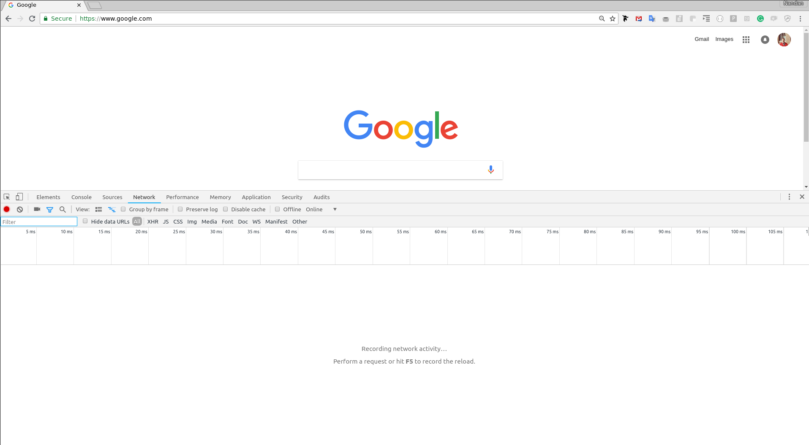
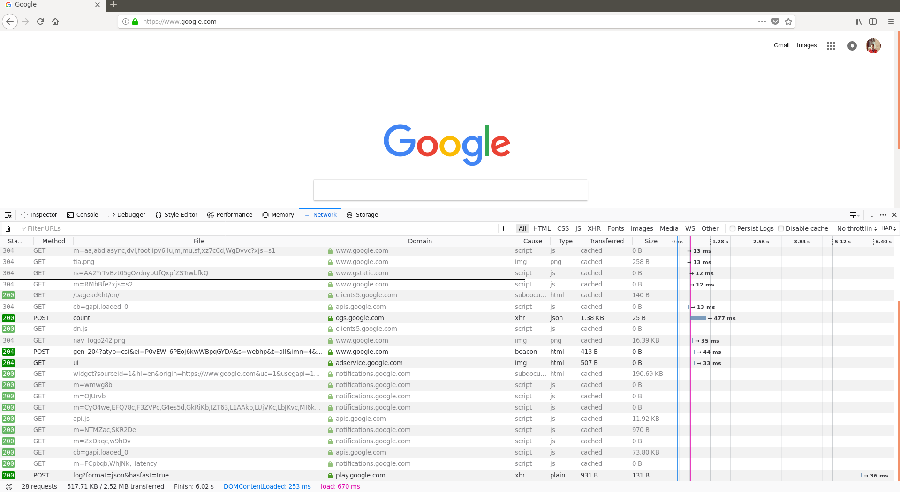

## HTTP

Hyper Text Transfer Protocol.

HTTP is a protocol, which is to say a set of rules and formats, that allows one computer to get content from another computer.

---

## Client and Server

HTTP is assymetric. One computer requests the content, while the other computer serves the content.

The computer requesting the content is the "client."

The computer serving the content is the "server."

You can think of HTTP as similar to the transaction that happens in a restaurant. Information needs to flow both ways between client and server, but the two parties have very different roles in the transaction. Thus it is an assymetric operation.

---

## Visiting a web page

When you visit twitter.com:

* Your browser (i.e. Firefox) is the client.
* The server is some custom-built software running in Twitter's cloud infrastructure somewhere.

Note that the client and the server are just software, they don't need to be (but usually are) running on separate physical hardware.

---

## Request/Response

* The format that the client uses to send information to the server is called a "request".
* The format that the server uses to send information to the client is called a "response".

When you visit twitter.com, your browser (the client) makes an HTTP request, and Twitter's server returns an HTTP response

---

## HTTP Methods

There are several types of requests the client can make. The type of the request is called the "method." There are several HTTP methods the client can choose from, but for now we will focus on one method:

GET

GET requests are the most common type of request when browsing the internet. It's a way for your client to say "give me some content."

---

## Requests

GET requests consist of:

* URL
* Additional Metadata

Responses consist of:

* Body (content)
* Status Code
* Additional Metadata

---

## URLs

A URL (Universal Resource Locator) is a type of URI (Universal Resource Identifier).

A URL is meant to be a unique identifier for a "resource", or a piece of content, that can be accessed via the world wide web.

A URL consists of:


 protocol     [subdomain.]      domain       [:port]    [/path]    [?query]
----------   --------------  ------------   ---------  ---------  -----------
 http://        blog.         science.com     :443       /foo       ?bar=baz


---

## Protocol

HTTP is unencrypted.

HTTPS is encrypted.

---

## Domains

Every computer connected to the internet lives at a certain address (domain/subdomain pair).

---

## Ports

Ports are like doors.

Every computer connected to the internet has thousands of potential ports.

A server is a piece of software that runs on a computer, and "listens" for HTTP requests on a certain port.

---


## Default Ports

* HTTP requests default to port 80
* HTTPS requests default to port 443

Most web pages serve content on the default ports, and as such, we drop the port from the URL.

---

## Servers

It's the internet's job to direct the HTTP request to the right address.

It's the computer's job to direct the HTTP request to the right port.

Then, it's up to the server listening on that port to send a response.


---

## Path

From one server, we often want to serve lots of different content.

Like the menu of a restaraunt.

A path is a unique identifier for each piece of content the server can provide (each item on the menu)

Paths are trees! Just like menus are organized categorically by their creators (burritos, tacos, tostadas), content within the server is organized with a taxonomy that is created by whoever wrote the server software.

---

## Query String

In a restaraunt, the food might be like:

- Burritos
 -- Chimichangas
 -- Grande
 -- Children's

While each burrito might have the following options:

Meat: Asada, Chorizo, Lengua, Soyrizo, Tofu
Cheese: Queso Fresco, Vegan Cheese

---

## Query String

Sometimes we want to allow options for each piece of content. A query string is a collection of key-value pairs (like a Python dictionary) that describe the content requested.

A Grande Burrito with Soyrzo and Vegan Cheese would look like this in a URL:

https://myburrito.com/burritos/grande?meat=soyrizo&cheese=vegan

---

## Servers

Paths and query strings are nothing but a way for the server to organize its content for the client. There are no strict rules, as long as the client can learn the format and the server is happy with the organization.

---

## Examining HTTP Requests and Responses

All modern browsers have a way for you to "inspect" the details of each HTTP request the browser makes, and each HTTP response the browser receives.

It is very important to get familiar with the "inspector" feature of your browser.

In the "inspector" window, there will be a tab called "network". This shows a list of all the requests that have been made. Sometimes, you will need to reload the page after opening the tab.

Clicking on each request will allow you to inspect it!

---

## Inspector (Chrome)


{height=275px}

---

## Inspector (Firefox)

{height=275px}


---

## Responses

Again, the responses consist of:

* Body (content)
* Status Code
* Additional Metadata

---

## Status Codes

In the HTTP GET Request, the client has requested a piece of content.

Status codes are a way for the server to tell the client whether the request can be handled.

Again, imagine the restaurant. The server at a restaurant needs to be able to tell you:

* "OK, coming right up".
* "Sorry, you're not allowed to have that, you're 12 years old and ordering whiskey".
* "Sorry we can't make that right now due to problems in our kitchen".
* "Sorry, that's not actually possible, we can't put a milkshake inside your burrito".

---

## Status Codes

HTTP, as a protocol, consists of a bunch of 3-digit numbers to communicate these basic responses. Some of the most common are:

* 200: OK
* 400: Malformed Request
* 403: Access Denied
* 404: Not Found
* 500: Internal Server Error

---

## Body
p
Content that is sent from the server to the client is referred to as the "body" of the response.

Content comes in raw bytes, and can consist of anything. It's a flexible format, such that any type of content can be sent from server to client.

The server needs some way to tell the client what type of data is in the body!

---

## Headers

All metadata sent in HTTP requests and responses lives in the "headers".

The headers are just a collection of key-value pairs.

Status codes live in the headers. The key is "status" and the value is the code number!

Another common header in HTTP Responses exists under the key "Content-Type". This tells the client what type of content is in the body, and thus how to decode it.

---

## Content-Types

There are 3 main content types you should know about:

* Plain text
* HTML
* JSON

---

## Plain Text

Plain text is the simplest form of content. It is not used very often in actual applications.

---

## JSON

JavaScript Object Notation.

An "object" in JavaScript is similar to a Dictionary in python. It's an associative data structure, a collection of key-value pairs!

JSON is the most common format for sending data over HTTP when the data is meant to be consumed by a computer program, rather than presented for a human to view.

API's (application programming interfaces) commonly use JSON to send data.

---

## JSON

An example of JSON:

```{js}

{
    "id": "b4vd345s45gd",
    "tweets": [12543, 9878945, 90384]
    "profile": {
        "name": "Man Onthe Moon",
        "location": "moon"
    }
}

```

---

## HTML

Hyper Text Markup Language.

HTML is a format used to encode content, so that it can be displayed for humans to read in a web browser.

HTML tells the browser what to display, and how to display it.

For example: if you have a heading (title) followed by two paragraphs. You need to tell the browser not only about the order of the text, but to make the heading larger and bolder, and to separate the paragraphs with a new line!

---

## HTML

HTML is a tree. It organizes all the content for the browser into a hierarchical taxonomy.

```{html}

                  |-- meta qux
       |-- head --|
       |          |-- script baz
html --|
       |          |-- div.foo
       |-- body --|
                  |-- div.bar
```


---

## HTML

The root node is called "html", which has only two possible child nodes, "head" and "body." Those two nodes can have unlimited children.

```{html}
<html>
    <head>
        ...
    </head>
    <body>
        <div class="foo"></div>
        <div class="bar"></div>
    </body>
</html>

```

---

## HTML

Each node of the tree is an "HTML element."

Some common elements:

```{html}
<div>
<p>
<span>
<h1>
<a>
```

---

## HTML

In addition to having children and/or text, each element can have "attributes." Some common attributes are "id" and "class":

```{html}
<div id="foo">
    <span class="email"> man@themoon.space </span>
</div>

```

---

## HTML

Elements, classes, and ids give us a way to traverse the HTML tree and target a specific node (and its subtree!)

This is very important. This is used in styling webpages as well as in web scraping.

Let's see an example:

---

## HTML

```{html}
<body>
    <div class="foo">
        <h3> EMAIL </h3>
        <span id="email"> man@themoon.space </span>
    </div>
    <article class="bar">
        <span> My Day </span>
        <p> Hello, I would like to discuss...</p>
    </article>
</body>
```

---

## HTML


Using CSS notation, we can target the email via:

```{css}
div.foo span#email
```

Additionally, we could simplify it to:

```{css}
.foo span
```

Because there is only one element with the class "foo", and only one span element inside that!

Or, because there is an id, we can use that and nothing else:

```{css}
#email
```

---


## HTML

(example with browser inspector on live webpage)

---

## HTML

Some elements have special attributes.

Anchor tags can have an "href" attribute, which is a link to another page. Anchor links and hrefs form the basis of the internet!

```{html}
<a href="https://man.mars/redmanred">
    Checkout my buddy's homepage!
</a>
```

---

## HTML

The head element contains the metadata for the webpage, as well as additional links to CSS and Javascript.

CSS is a language for applying "styling" to a page.

Javascript is a programming language that runs dynamically in the browser.

---
